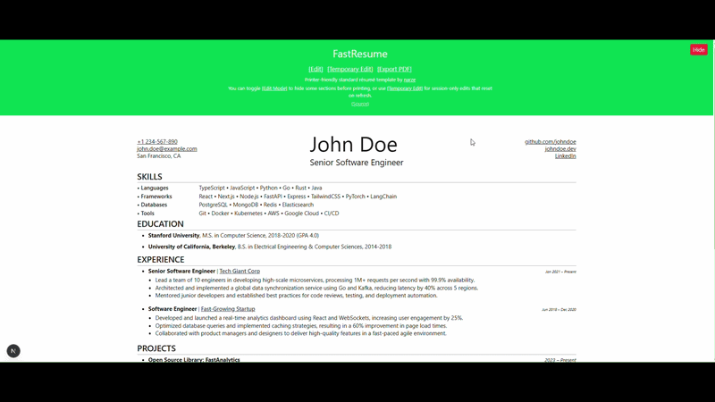

# FastResume 🚀

FastResume is a high-performance, AI-enhanced resume builder designed for developers and technical professionals who need speed, precision, and ATS-optimized output.



---

## 🌟 Key Features

### 🤖 AI Resume Tailor

Stop manually editing bullet points for every job application. FastResume includes an integrated **AI Tailoring Tool** that:

- Analyzes any Job Description (JD).
- Ruthlessly prunes and rewrites your resume content to fit a strict **one-page constraint**.
- Prioritizes most recent experiences and mirrors ATS keywords effectively.
- Returns a perfectly structured JSON that you can apply instantly.

### 📝 Temporary Edit Mode

Iterate in real-time without touching your source files.

- The **Temporary Editor** allows you to paste or modify your resume JSON in a session-only environment.
- Perfect for quick "what-if" scenarios or applying AI-tailored content before exporting.

### 📄 PDF Export

Get a clean, ATS-friendly, and minimalist resume every time using the browser's native print-to-PDF functionality, enhanced by specific `@media print` CSS refinements.

---

## 🛠️ Technology Stack

- **Framework**: Next.js 15
- **AI**: Vercel AI SDK + Google Gemini
- **Styling**: Vanilla CSS + Tailwind CSS
- **Language**: TypeScript

---

## 🚀 Getting Started

### 1. Installation

FastResume prefers `pnpm` for package management.

```bash
git clone https://github.com/Thiraput01/FastResume.git
cd FastResume
pnpm install
```

### 2. Run Development Server

```bash
pnpm dev
```

### 3. Configure AI (Optional)

To use the AI Tailor Tool, you satisfy the requirements in the UI:

1. Provide a **Gemini API Key**.
2. Paste the **Job Description**.
3. Click **Tailor Resume**.

---

## ⚙️ Customization

### 📝 Your Resume Data (`lib/data.ts`)

To personalize the resume, update the exported constants in `lib/data.ts`. This file serves as the source of truth for:

- `introData`: Personal info, social links, and website.
- `technologies`: Your skill categories and details.
- `experiences` & `projects`: Use the simplified `url` field for any demo or source code links (the UI automatically detects GitHub links).
- `activities`: Awards and extra-curriculars.

### 🤖 AI Configuration (`lib/ai-config.ts`)

You can fine-tune the AI behavior with the folloing configuration:

- **Change Model**: Update the `AI_MODEL` variable (default is `gemini-3-flash-preview`).
- **Tweak the Prompt**: Edit `getTailorPrompt` to change how the AI rewrites your bullet points (e.g., to focus more on results, specific keywords, or a different tone).

---

## 🤝 Credits

Inspired by the minimalist standard résumé template by [narze](https://github.com/narze/resume) and refined through the [resumette](https://github.com/Leomotors/resumette) ecosystem.
